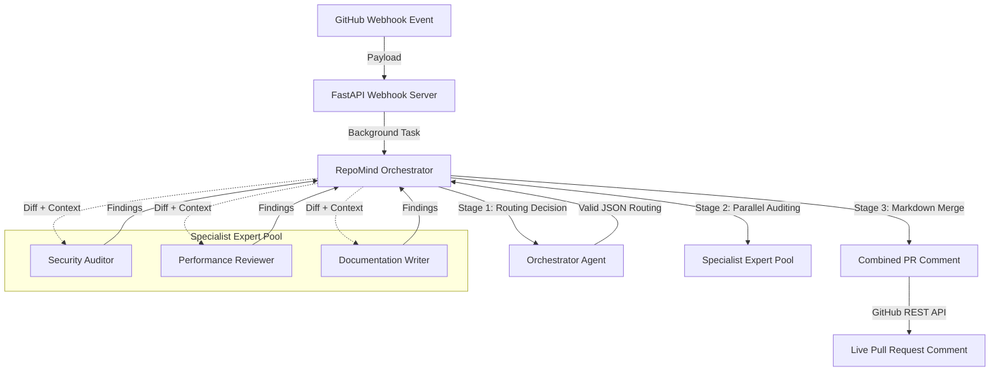

# 🤖 RepoMind

[](https://fastapi.tiangolo.com)
[](https://groq.com)
[](https://gitagent.sh)
[](LICENSE)

**RepoMind** is a next-generation, autonomous multi-agent developer pipeline built on the open **GitAgent** specification. It monitors GitHub events via webhooks, coordinates specialist LLM agents to perform context-aware reviews (Security, Performance, Documentation, Triage), and writes comments back to your PRs and issues automatically.

Powered by **Groq**'s ultra-fast inference and running the **GitAgent** directory-based agent system, RepoMind is fully self-contained, portable, and version-controlled.

---

## 🏗️ Architecture & Flow

RepoMind uses a Hub-and-Spoke model where a master orchestrator agent reviews incoming events and dynamically delegates tasks to isolated expert agents.



---

## 🕵️‍♂️ Meet the Agents

Each agent is defined as a standalone folder using the **GitAgent** standard. Their identity, rules, duties, and skills are versioned directly in Git:

### 1. 🧠 `repomind-orchestrator`
*   **Role**: Master Router (`dispatcher`)
*   **Purpose**: Receives events, parses changes, determines urgency, and executes parallel specialized agent workflows.
*   **Files**: [`SOUL.md`](agents/orchestrator/SOUL.md), [`RULES.md`](agents/orchestrator/RULES.md), [`DUTIES.md`](agents/orchestrator/DUTIES.md)
*   **Skills**: `routing` (Classifies payload, extracts diff metadata)

### 2. 🔒 `security-auditor`
*   **Role**: Paranoid Security Engineer (`checker`)
*   **Purpose**: Scans code diffs for SQL injections, hardcoded secrets, insecure crypto, RCEs, and OWASP Top 10 flaws.
*   **Files**: [`SOUL.md`](agents/security-auditor/SOUL.md), [`RULES.md`](agents/security-auditor/RULES.md)
*   **Skills**: `vuln-scan` (Regex and semantic code auditing)
*   **Knowledge**: [`owasp-top10.md`](agents/security-auditor/knowledge/owasp-top10.md), [`secret-patterns.md`](agents/security-auditor/knowledge/secret-patterns.md)

### 3. ⚡ `perf-reviewer`
*   **Role**: Ultra-Scale Optimization Specialist
*   **Purpose**: Detects O(N²) loops, ORM N+1 database queries, regex compilation in loops, and heavy materializations.
*   **Files**: [`SOUL.md`](agents/perf-reviewer/SOUL.md), [`RULES.md`](agents/perf-reviewer/RULES.md)
*   **Skills**: `perf-analysis` (Complexity and execution hot path checks)

### 4. 📝 `doc-writer`
*   **Role**: Clarity-Focused Technical Writer
*   **Purpose**: Audits public functions/classes for missing Google-style docstrings, writes type-hint suggestions, and generates Changelog updates.
*   **Files**: [`SOUL.md`](agents/doc-writer/SOUL.md), [`RULES.md`](agents/doc-writer/RULES.md)
*   **Skills**: `docgen` (Extracts additions and writes docstring blocks)

### 5. 🔍 `bug-triager`
*   **Role**: Welcoming First Responder
*   **Purpose**: Classifies incoming GitHub issues, maps P0-P3 priorities, flags missing repro/version info, and welcomes reporters.
*   **Files**: [`SOUL.md`](agents/bug-triager/SOUL.md), [`RULES.md`](agents/bug-triager/RULES.md)
*   **Skills**: `triage` (Issue parsing and tagging)

---

## 📂 Project Directory Structure

```text
repomind/
├── .gitignore
├── README.md               # You are here!
├── agents/                 # Autonomous GitAgent directories
│   ├── orchestrator/       # Master coordinator config & skills
│   ├── security-auditor/   # Security auditor config, rules & knowledge
│   ├── perf-reviewer/      # Complexity reviewer config & skills
│   ├── doc-writer/         # Documentation parser config & skills
│   └── bug-triager/        # Issue triage config, rules & memory
├── backend/                # FastAPI server & orchestrator harness
│   ├── main.py             # FastAPI entrypoint & verification
│   ├── orchestrator.py     # GitAgent prompt compilation & runner
│   └── requirements.txt    # Python dependencies
└── workflows/              # Workflow definitions
    ├── issue-triage-flow.yaml
    └── pr-review-flow.yaml
```

---

## 🚀 Quick Start

### 1. Clone the Project
```bash
git clone https://github.com/gopalrawat14/repoMind.git
cd repoMind
```

### 2. Configure Environment Variables
Create a `.env` file at the root of the project:
```env
GROQ_API_KEY=your_groq_api_key
GITHUB_TOKEN=your_github_personal_access_token
GITHUB_WEBHOOK_SECRET=repomind_secret_123
```

### 3. Install Dependencies
```bash
pip3 install -r backend/requirements.txt
```

### 4. Run the Webhook Server
Start the Uvicorn web server with auto-reload:
```bash
uvicorn backend.main:app --host 0.0.0.0 --port 8000 --reload
```

---

## 🧪 Testing Locally

You can simulate GitHub Webhook payloads directly against local test endpoints:

### Test Issue Triage
```bash
curl -X POST http://localhost:8000/test/issue \
  -H "Content-Type: application/json" \
  -d '{
    "number": 1,
    "title": "App crashes when uploading files larger than 10MB",
    "body": "TypeError: Cannot read property size of undefined in Chrome.",
    "repo": "your_user/your_repo"
  }'
```

### Test PR Review (Security + Performance scan)
```bash
curl -X POST http://localhost:8000/test/pr \
  -H "Content-Type: application/json" \
  -d '{
    "number": 1,
    "title": "Add Auth System",
    "body": "Implements login with JWT and password hashing",
    "repo": "your_user/your_repo"
  }'
```

---

## 🛡️ Spec Compliance
All agents configured in this project strictly follow and validate against the **GitAgent Open Standard Spec (`spec_version: 0.1.0`)**.

To manually validate the agents:
```bash
npm install -g @open-gitagent/gitagent
gitagent validate -d agents/orchestrator
gitagent validate -d agents/security-auditor
gitagent validate -d agents/perf-reviewer
gitagent validate -d agents/doc-writer
gitagent validate -d agents/bug-triager
```

---

## 📄 License
This project is licensed under the MIT License - see the [LICENSE](LICENSE) file for details.
